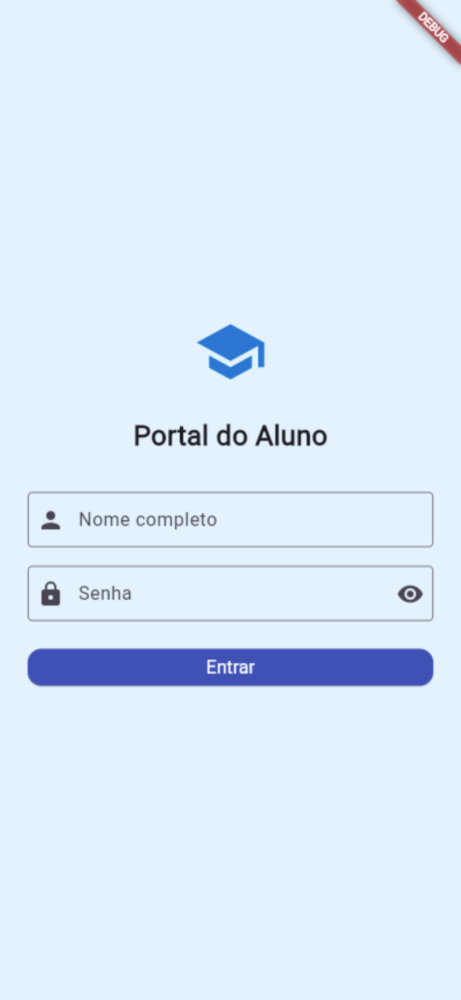
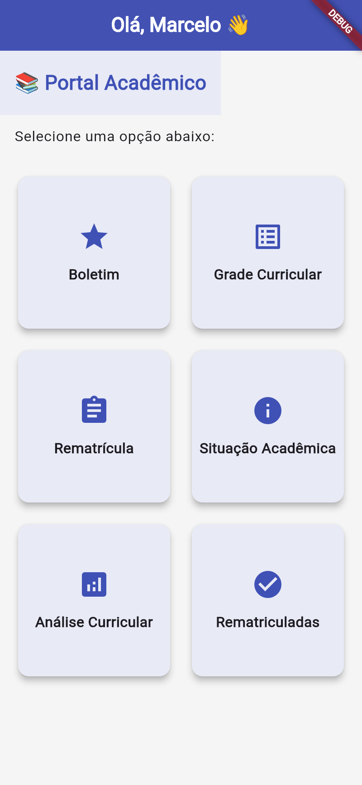
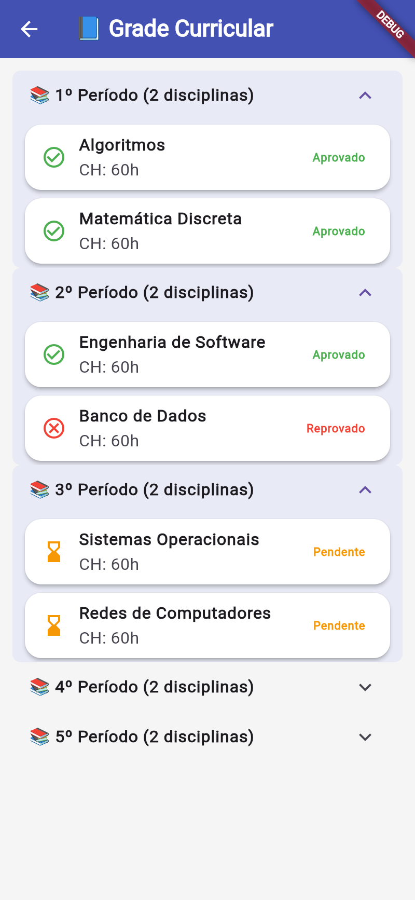
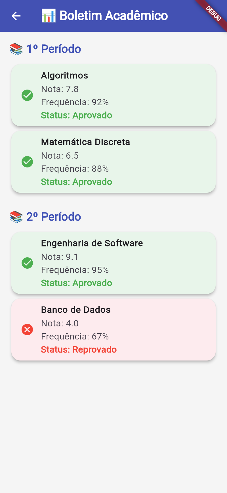
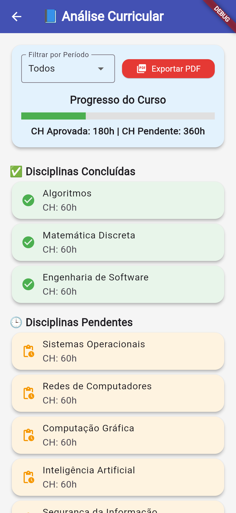
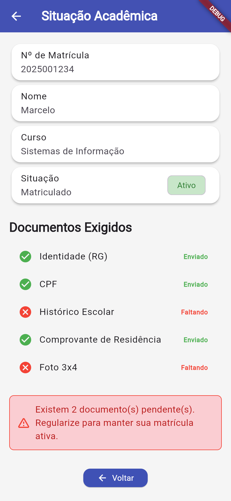
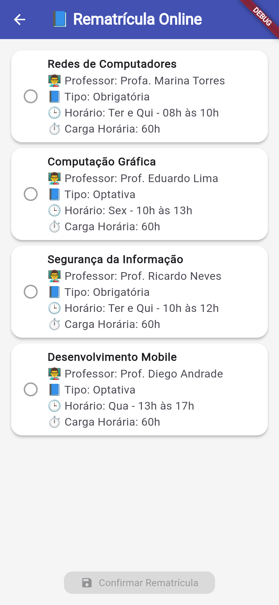
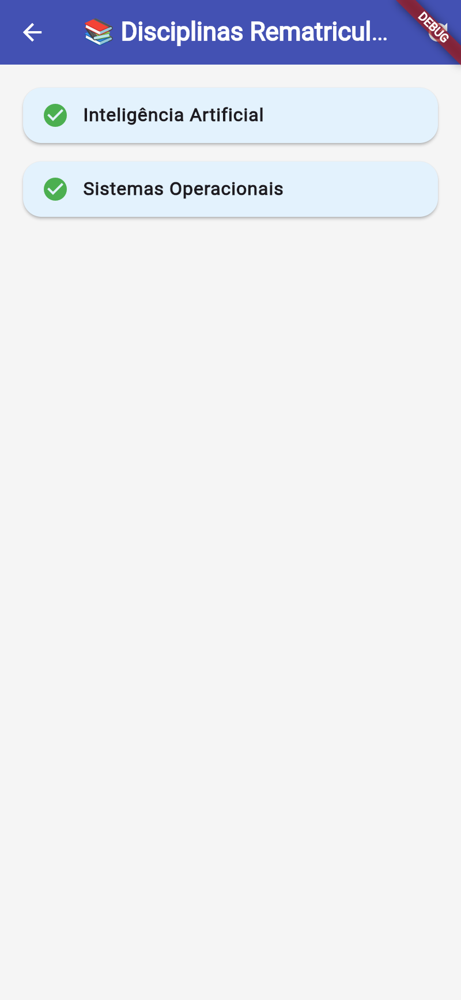

# 🎓 Flutter Acadêmico - Portal do Aluno

Este é um aplicativo Flutter desenvolvido para fins acadêmicos. Ele simula um **portal do aluno**, com funcionalidades como boletim, grade curricular, análise de progresso, situação acadêmica e rematrícula online. Os dados são consumidos da API [MockAPI.io](https://mockapi.io).

---

## 🚀 Funcionalidades

- Login simples (sem autenticação real)
- Dashboard com navegação entre funcionalidades
- 📊 Visualizar boletim com nota, frequência e status
- 📘 Visualizar grade curricular com agrupamento por período
- 📈 Acompanhar progresso e CH na análise curricular
- 🧾 Visualizar situação acadêmica com alerta de pendências
- ✅ Selecionar disciplinas para rematrícula
- Exportar análise curricular como PDF
- API REST simulada com MockAPI

---

## 📱 Telas do Aplicativo

### 🔐 Login

### 🏠 Dashboard

### 📘 Grade Curricular

### 📊 Boletim

### 📈 Análise Curricular

### 🧾 Situação Acadêmica

### 🔁 Rematrícula Online

### ✅ Disciplinas Rematriculadas

---

## 📁 Estrutura de Diretórios

lib/
├── main.dart
├── models/
│ └── disciplina.dart
├── providers/
│ └── user_provider.dart
├── screens/
│ ├── login_screen.dart
│ ├── dashboard_screen.dart
│ ├── boletim_screen.dart
│ ├── grade_curricular_screen.dart
│ ├── analise_curricular_screen.dart
│ ├── situacao_screen.dart
│ ├── rematricula_screen.dart
│ └── rematriculadas_screen.dart
├── services/
│ └── disciplina_service.dart
├── screenshots/
│ └── *.png (imagens usadas neste README)

---

## 🛠 Tecnologias Utilizadas

- Flutter 3.x
- Dart
- HTTP (para consumo da API)
- PDF e Printing (para geração de relatórios)
- MockAPI.io (dados simulados)

---

## 📝 Observações

Este projeto foi desenvolvido com fins acadêmicos e não possui persistência de dados real. Ideal para demonstrações e aprendizado com Flutter + API REST.
